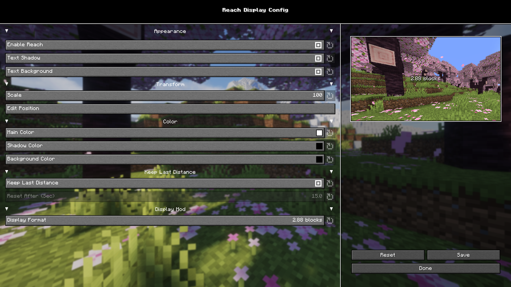

  

---

## 📌 About
**Reach Display** is a HUD mod that shows your current block reach distance in real time.  
Great for PvP, or simply understanding how far you can interact.

Fully client-side. No server required.

---

## ✨ Features
- 📏 Shows your current reach distance
- 🎨 Fully customizable colors (text / shadow / background)
- 🪟 Adjustable position & scale
- 🔄 Different display formats:
  - `2.88`
  - `2.88 blocks`
  - `2.88 M`
- 🧼 Optional: keep-last-distance timer

---

## 🖼️ Screenshots
### 🎮 In-Game Preview

  

### ⚙️ Configuration Screen  

  

---

## 📦 Installation
Requires:

- **Fabric Loader**
- **Fabric API**
- *(Optional)* **Mod Menu** — to easily open the configuration screen

---

## 📝 License
This project is licensed under the **MIT License**.
